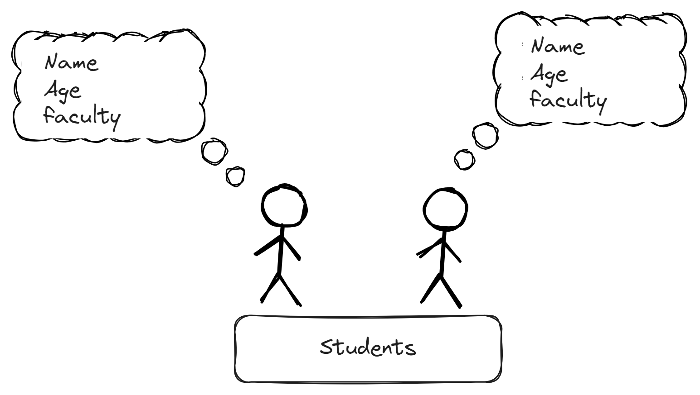

# Class and Objects
> Note: Dedicated code example file is availabe to test on local machine. 

## Class
The building block of C++ that leads to Object-Oriented programming is a Class. It is a user-defined data type, which holds own data member and member functions, which can be sccessed and used by creating an instance of that class. A class is like a blueprint for an object. For Example: Consider the Class of cars. There may be many cars with different names and brand but all of them will share some common properties like all of them will have 4 wheels, Speed limit, Mileage range, etc, So here, the Car is the class and wheels, speed limits and mileage are their properties.

- A Class is a user-defined data type that has data members and member functions.
- Data members are the variables and member functions used to manipulate these variables together these data members and members functions defined the properties and behaviour of the objects in a class.


### Here is an simple example of class
\


On the above example their are two students. They share same properties in college such as Name, age, faculty. They have Same class name Students. let's look at the code 
> Example:

```c++

class Students{
    //Lets make it Public
    public:
        string name;
        int age;
        string faculty;
};
```

## Object
An object is an identifiable entity with some characteristics and behaviour. An Object is an instance of a Class. When a class is defined, no memory is allocated but when it ie instantiated (i.e an object is created ) memory is allocated.

> Example:

```c++
#include <iostream>

class Students{
    //Lets make it Public
    public:
        string name;
        int age;
        string faculty;
};

int main(){
    Students student; //student is the object of Students
    return 0;
} 
```
[Class and Objects in Detail]()
